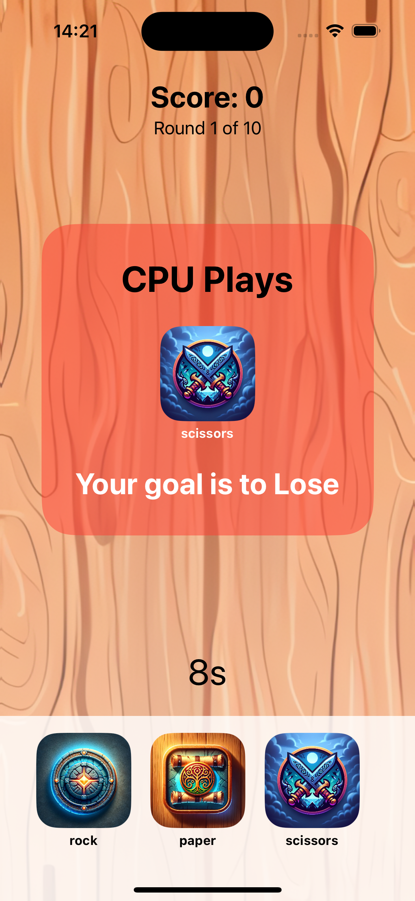

# vikingbraintraining
A viking-themed brain training game built with SwiftUI. 



## Getting Started

To run **Viking Brain Training**, you'll need to have Xcode installed on your Mac. The game is not distributed on the App Store, so you'll run it using the Xcode simulator or directly on your device. Here's how to get started:

### Prerequisites

- macOS with the latest version of Xcode installed.
- An Apple Developer account, if you wish to run the game on a physical device.

### Installation

1. **Clone the Repository**

   Open Terminal and clone the repository to your local machine:
   
   ```bash
   git clone https://github.com/dimdal/vikingbraintraining.git
   ```
   

2. **Open the Project in Xcode**

Navigate to the cloned repository folder, and open the project file (`VikingBrainTraining.xcodeproj`) in Xcode:

```bash
cd VikingBrainTraining
open VikingBrainTraining.xcodeproj
```

3. **Choose the Simulator or Device**

In Xcode, select the target device from the scheme dropdown menu at the top of the window. You can choose either a simulator or a physical device connected to your Mac.

4. **Run the Game**

Click the "Run" button (the play icon) in the top left corner of Xcode. Xcode will build the project and run the game on your chosen simulator or device.

### Running on a Physical Device

To run the game on a physical iOS device:

1. Connect your device to your Mac via USB.
2. Select your device from the scheme dropdown menu in Xcode.
3. You may need to trust the developer certificate on your device by going to `Settings > General > Device Management` on your iOS device.
4. Click the "Run" button in Xcode to install and launch the game on your device.

